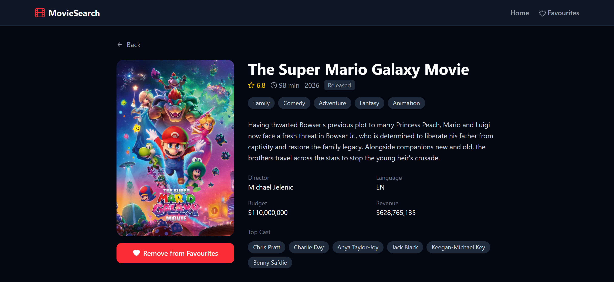
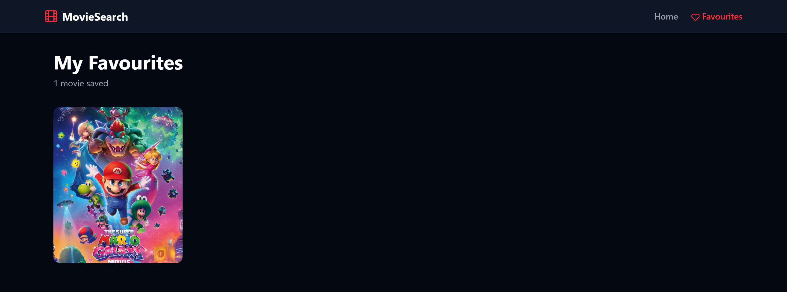

# 🎬 MovieSearch

A modern movie discovery app built with React, powered by the TMDB API.

🔗 **Live Demo:** [moviesearch-delta-one.vercel.app](https://moviesearch-delta-one.vercel.app/)

---

## ✨ Features

- 🔍 Search millions of movies and TV shows
- 🎭 Browse by genre
- 📄 Detailed movie pages with cast, crew, budget & more
- ❤️ Save favourites with localStorage persistence
- 📱 Fully responsive design
- ⚡ Memory caching for instant repeat searches
- 🔄 Load more pagination
- 🌐 Back to top button
- 💀 Skeleton loading states
- 🚫 Graceful error handling

---

## 🛠️ Built With

- **React** — UI library
- **Vite** — Build tool
- **Tailwind CSS** — Styling
- **React Router** — Navigation
- **TMDB API** — Movie data
- **React Icons** — Icon library

---

## 📁 Project Structure

<details>
<summary><strong>Click to expand</strong></summary>

```plaintext
src/
├── components/
│   ├── layout/
│   │   ├── Header.jsx
│   │   └── MainLayout.jsx
│   └── ui/
│       ├── MovieCard.jsx
│       ├── SearchBar.jsx
│       ├── GenreFilter.jsx
│       ├── SkeletonCard.jsx
│       ├── EmptyState.jsx
│       ├── BackToTop.jsx
│       └── Button.jsx
├── pages/
│   ├── Home.jsx
│   ├── MovieDetail.jsx
│   ├── Favourites.jsx
│   └── NotFound.jsx
├── hooks/
│   ├── useSearch.js
│   ├── useMovieDetail.js
│   ├── useFavourites.js
│   ├── useScroll.js
│   └── usePageTitle.js
├── services/
│   └── movieService.js
├── utils/
│   ├── helpers.js
│   └── cache.js
├── constants/
│   └── index.js
└── App.jsx
```

</details>

---

## 🚀 Getting Started

### Prerequisites

- Node.js 18+
- TMDB API key ([get one here](https://www.themoviedb.org/settings/api))

### Installation

```bash
# Clone the repository
git clone https://github.com/bilal-ahmed-tech/movie-search-app

# Navigate to project
cd movie-search-app

# Install dependencies
npm install

# Create .env file
echo "VITE_TMDB_API_KEY=your_api_key_here" > .env

# Start development server
npm run dev
```

---

## 🔑 Environment Variables

```env
VITE_TMDB_API_KEY=your_tmdb_api_key
```

---

## 📸 Screenshots


<br/><br/>

<br/><br/>


---

## 🧠 Key Concepts Used

- Custom hooks (`useSearch`, `useMovieDetail`, `useFavourites`)
- Memory caching with `Map`
- React Router dynamic routes
- `localStorage` persistence
- Skeleton loading states
- Error boundaries
- Responsive design

---

## 📝 License

MIT License — feel free to use this project for learning or portfolio purposes.

*Built as a portfolio project to showcase React, API integration, and performance optimization techniques.*